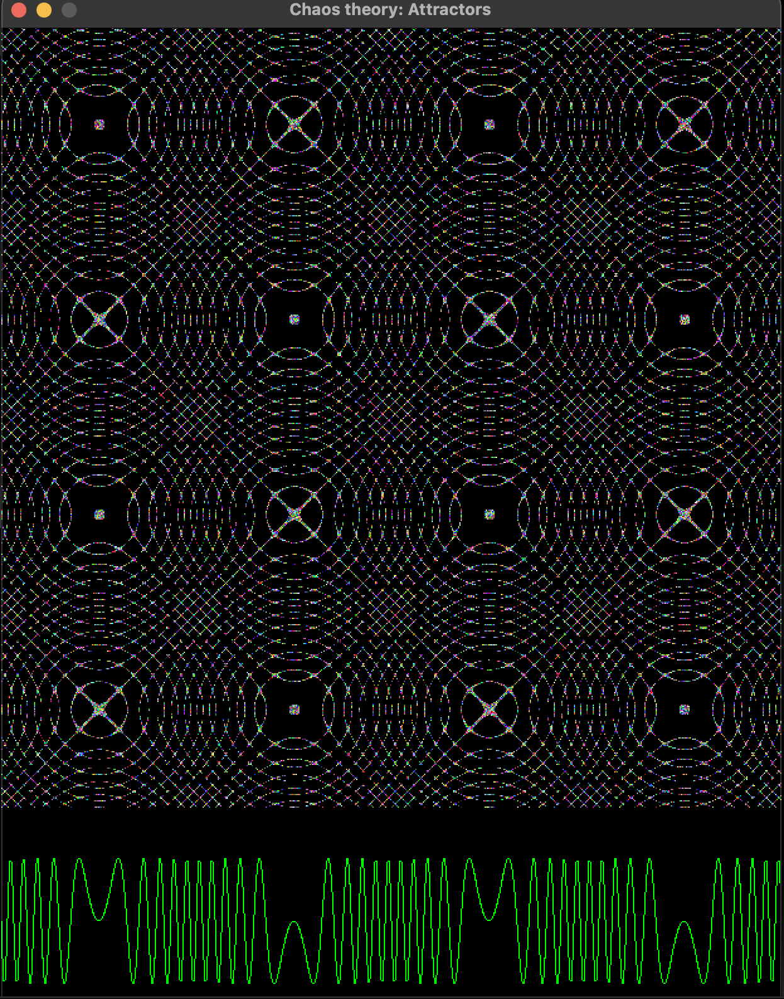

# Attractors : Chaos theory

- ref: http://www.3d-meier.de/tut19/Seite0.html

## Recurrence plot



## Field Simulation

- inspired from [this](https://www.instagram.com/reel/C5rnOYRRP1r/?utm_source=ig_web_copy_link&igsh=MzRlODBiNWFlZA==) video, I tried to simulate the field given by the following differential equation:

```
dx/dt = 50*x*sin(y/50)
dy/dt = 50*y*cos(x/50)
```


https://github.com/CrypticMessenger/cool-algorithms/assets/75074904/e068b6bd-f41d-44c6-990d-ff98f5523770


<video width="320" height="240" controls>
  <source src="./resources/fieldSimulation.mov" type="video/mp4">
  Your browser does not support the video tag.
</video>
