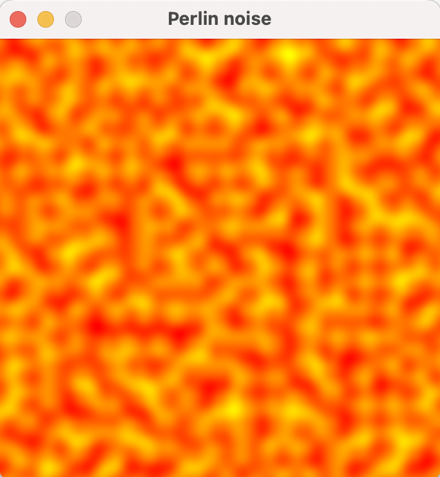

# Perlin Noise Implementation

## Overview

This repository contains an implementation of Perlin noise, a gradient noise function widely used in computer graphics to generate natural-looking textures, terrains, and other procedural content.

## screenshot

